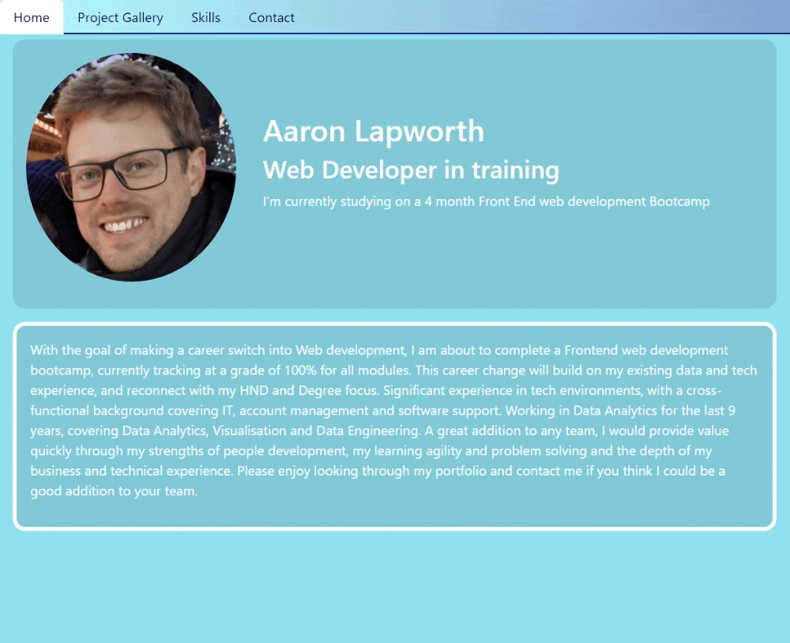

# react_portfolio
Week 13 assignment - portfolio created using React Router

## Description

The task was to develop the initial scaffolding for your first portfolio site, as well as create or update other materials so that you can showcase your skills to potential employers.

Remember, "good" design is subjective. Your site should look "polished" and "professional." Here are a few guidelines on what that means:
* Use mobile-first design.
* Choose a color palette for your site so it doesn't just look like the default bootstrap theme or an unstyled HTML site.
* Make sure the font size is large enough to read and that the colors don't cause eye strain.

Base Requirements
Your portfolio must meet the following requirements:
* The following technologies must be used:
    * React
    * Navigation using React Router, dynamic rendering, or another third part router
* Your portfolio must contain the following information:
    * Your name
    * Links to your:
    * GitHub profile
    * LinkedIn page
    * Email address
    * Phone number (optional)
    * CV (in PDF format)
     * Your CV must contain up-to-date projects and professional experience
    * A list of projects (Challenges or Projects). For each project, make sure you have the following:
        * Project title
        * Link to the deployed version
        * Link to the GitHub repository
        * GIF or screenshot of the deployed application

Required Components
At a minimum, your portfolio must render these 6 components:
* App
* Header
* Home page
* Projects page
* Project (on Projects page)
* Contact page
* Component Content and Requirements
Each of the following components must follow these guidelines:
* App:
    * Must be your top-level component and render all necessary child components
    * Header:
    * Must be rendered across every page component of the site
    * Must contain a Navbar
* Home page:
    * This should be a welcome landing page that contains:
    * Your Name
    * A headshot of you (or an avatar)
    * Your brand statement
    * Some indication that this is your portfolio site
* Projects page:
    * Must render six instances of the Project component dynamically
    * Be sure to store your project details data in a JSON file and import it into your project
* Project:
    * Must be a reusable component that ingests JSON data as props and renders a single instance for each project
    * Must utilize Router props to properly render the right project based on user selection
    * Must render the following info:
    * Project title
    * Link to the deployed version
    * Link to the GitHub repository
    * GIF or screenshot of the deployed application
* Contact page:
    * Must include contact information:
    * Email address
    * Link to a PDF version of your CV
    * Link to your GitHub profile
    * Link to your LinkedIn page
    * Must have a contact form for handling events

Website: https://lapworthaaron.github.io/react_portfolio
 Repository: https://github.com/LapworthAaron/react_portfolio

In this project I have learnt how to use React.js, inparticular React Router.

## Table of Contents (Optional)

- [Installation](#installation)
- [Credits](#credits)
- [License](#license)

## Installation

Install folder structure as is, into a root directory.
Then follow the install requirements in the package.json `npm install`
If you don't want to use `npm install` then run the following for individual packages:
* you will need to install react-bootstrap using npm `npm install react-bootstrap`

## Credits

© 2023 Aaron Lapworth. Confidential and Proprietary. All Rights Reserved.

## License

MIT License

Copyright (c) 2023 Aaron Lapworth

Permission is hereby granted, free of charge, to any person obtaining a copy
of this software and associated documentation files (the "Software"), to deal
in the Software without restriction, including without limitation the rights
to use, copy, modify, merge, publish, distribute, sublicense, and/or sell
copies of the Software, and to permit persons to whom the Software is
furnished to do so, subject to the following conditions:

The above copyright notice and this permission notice shall be included in all
copies or substantial portions of the Software.

THE SOFTWARE IS PROVIDED "AS IS", WITHOUT WARRANTY OF ANY KIND, EXPRESS OR
IMPLIED, INCLUDING BUT NOT LIMITED TO THE WARRANTIES OF MERCHANTABILITY,
FITNESS FOR A PARTICULAR PURPOSE AND NONINFRINGEMENT. IN NO EVENT SHALL THE
AUTHORS OR COPYRIGHT HOLDERS BE LIABLE FOR ANY CLAIM, DAMAGES OR OTHER
LIABILITY, WHETHER IN AN ACTION OF CONTRACT, TORT OR OTHERWISE, ARISING FROM,
OUT OF OR IN CONNECTION WITH THE SOFTWARE OR THE USE OR OTHER DEALINGS IN THE
SOFTWARE.